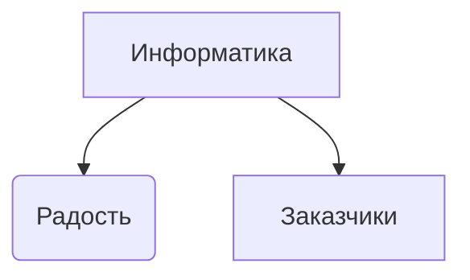
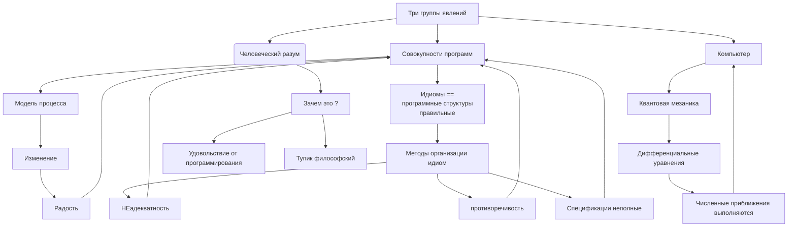

```mermaid
flowchart  TD
    A[Информатика] --> B(Радость)
    A --> C[Заказчики]
```

```mermaid
flowchart  TD
    A[Три группы явлений] --> B(Человеческий разум)
    A --> C[Совокупности программ]
    A --> D[Компьютер]
    C --> E[Модель процесса]
    E --> F[Изменение]
    F --> G[Радость]
    G --> C
    C --> J[Идиомы == <br> программные структуры <br> правильные]
    J --> JB[Методы организации идиом]
    JB --> K[НЕадекватность]
   JB --> L[противоречивость] 
   JB --> M[Спецификации неполные]
   K--> C
   L--> C
   M --> C
   D --> КМ[Квантовая мезаника]
   КМ-->ДУ[Дифференциальные уравнения]
   ДУ--> ЧП[Численные приближения выполняются]
   ЧП--> D
   B --> ЗЭВ[Зачем это ?]
   ЗЭВ --> УП[Удовольствие от программирования]
   ЗЭВ --> ФТ[Тупик философский]
```
